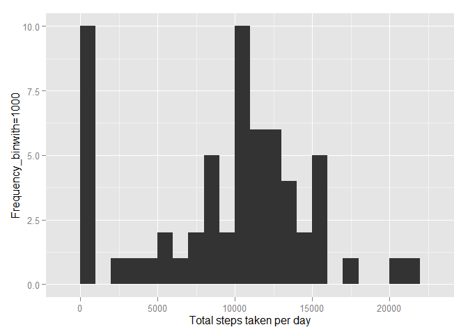
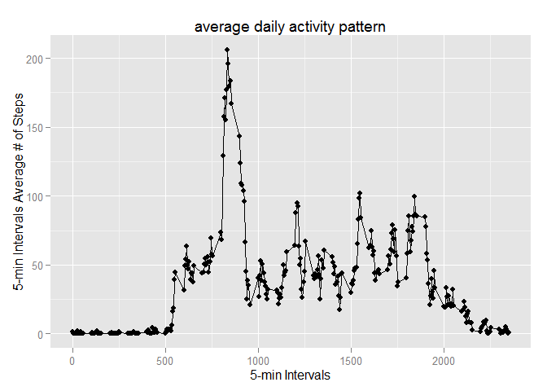
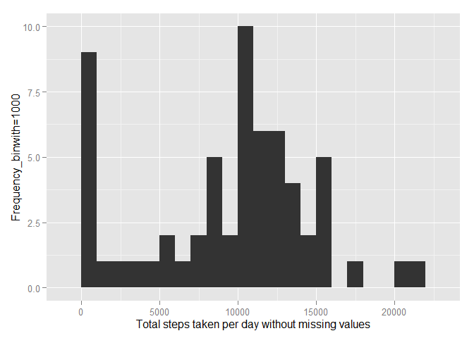
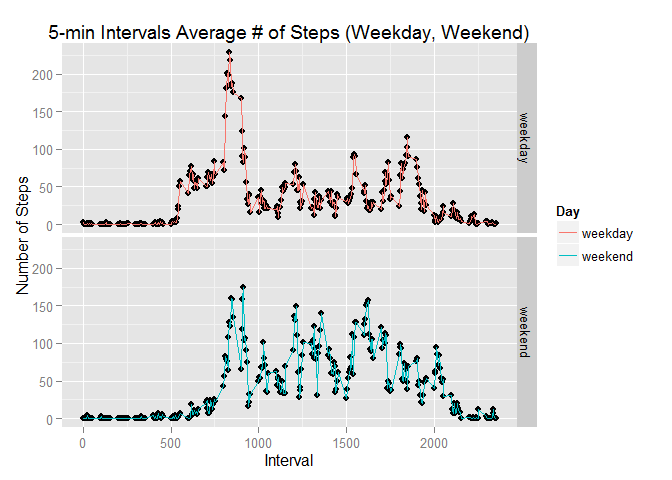

# Reproducible Research: Peer Assessment 1


## Loading and preprocessing the data


```r
library(ggplot2)

if(!file.exists('activity.csv')){
    unzip('activity.zip')
}

Data<-read.csv("activity.csv")
```

## What is mean total number of steps taken per day?

```r
StepsPerDay <- tapply(Data$steps, Data$date, sum, na.rm=TRUE)
StepsPerDay_Mean <- mean(StepsPerDay)
StepsPerDay_Median <- median(StepsPerDay)

qplot(StepsPerDay, xlab='Total steps taken per day', ylab='Frequency_binwith=1000', binwidth=1000)
```

 

```r
message("The Mean Steps per Day is ", StepsPerDay_Mean, " & ", "The Median Steps per Day is ", StepsPerDay_Median)
```

```
## The Mean Steps per Day is 9354.22950819672 & The Median Steps per Day is 10395
```

## What is the average daily activity pattern?


```r
#DataPrep

averageStepsPer5MinsInterval <- aggregate(x=list(meanSteps=Data$steps), by=list(interval=Data$interval), FUN=mean, na.rm=TRUE)

#Make a time series plot

qplot( x = interval, y = meanSteps, data = averageStepsPer5MinsInterval ) +
    geom_line() +
    xlab("5-min Intervals") +
    ylab("5-min Intervals Average # of Steps") +
    ggtitle("average daily activity pattern")
```

 

```r
#Which 5-minute interval, on average across all the days in the dataset, contains the maximum number of steps?

mostSteps <- which.max(averageStepsPer5MinsInterval$meanSteps)
intervalMostSteps <-  gsub("([0-9]{1,2})([0-9]{2})", "\\1:\\2", averageStepsPer5MinsInterval[mostSteps,'interval'])

message("The maximum number of steps per 5min Interval is ", mostSteps, ", ", "in the interval ", intervalMostSteps)
```

```
## The maximum number of steps per 5min Interval is 104, in the interval 8:35
```

## Imputing missing values


```r
#Calculate and report the total number of missing values in the dataset

numberOfMissingValues<- sum(is.na(Data))
message("The  number of of missing values in the dataset is ", numberOfMissingValues)
```

```
## The  number of of missing values in the dataset is 2304
```

```r
#Replacing NA with median of that 5min interval

medianStepsinInterval <- aggregate(steps ~ interval, data = Data, FUN = median)
missingValues <- is.na(Data$steps)
Data$steps[missingValues] <- medianStepsinInterval$steps[missingValues]

#Create a new dataset that is equal to the original dataset but with the missing data filled in.

NoMissingValuesData<- Data

#Make a histogram of the total number of steps taken each day and Calculate and report the mean and median

StepsPerDay_noNa <- tapply(NoMissingValuesData$steps, NoMissingValuesData$date, sum, na.rm=TRUE)
StepsPerDay_Mean_noNa <- mean(StepsPerDay_noNa)
StepsPerDay_Median_noNa <- median(StepsPerDay_noNa)

qplot(StepsPerDay_noNa, xlab='Total steps taken per day without missing values', ylab='Frequency_binwith=1000', binwidth=1000)
```

 

```r
message("The Mean Steps per Day without NA is ", StepsPerDay_Mean, " & ", "The Median Steps per Day without NA is ", StepsPerDay_Median)
```

```
## The Mean Steps per Day without NA is 9354.22950819672 & The Median Steps per Day without NA is 10395
```
## Are there differences in activity patterns between weekdays and weekends?


```r
#Create a new factor variable in the dataset with two levels - "weekday" and "weekend" indicating whether a given date is a weekday or weekend day.

Data$date<-as.Date(Data$date)
Data$DayType<-weekdays(Data$date)

weekdayWeekend <- function(DayType) {
     if (weekdays(DayType) %in% c("Saturday", "Sunday")) day <- "weekend"
     else day <- "weekday"
     
     day
   }
   
   Data$weekdays <- as.factor(sapply(Data$date, weekdayWeekend))
   
   WeekdaysIntervalAveNofSteps <- aggregate(steps ~ interval + weekdays, data = Data, mean)
   
   weekdaysList <- list('weekday'="weekday", 'weekend'="weekend")
   dayLabels <- function(variable,value) weekdaysList[value]

#Make a panel plot containing a time series plot (i.e. type = "l") of the 5-minute interval (x-axis)
#and the average number of steps taken, averaged across all weekday days or weekend days (y-axis).

   qplot(x = interval, y = steps, data = WeekdaysIntervalAveNofSteps ) +
     geom_line(aes(color = factor(weekdays)) ) + 
     facet_grid(weekdays ~ ., labeller = dayLabels) +
     xlab("Interval") +
     ylab("Number of Steps") +
     labs(colour = "Day") +
     ggtitle("5-min Intervals Average # of Steps (Weekday, Weekend)")
```

 


